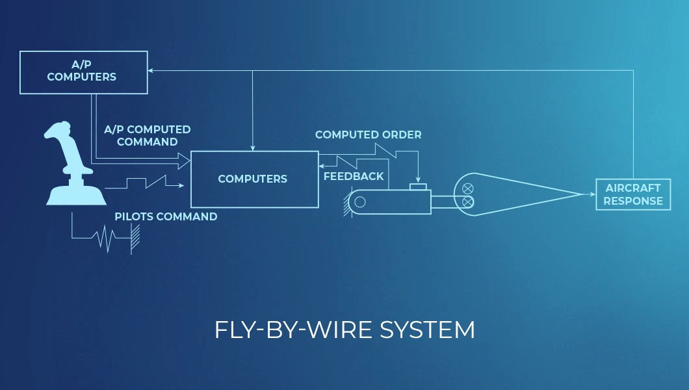
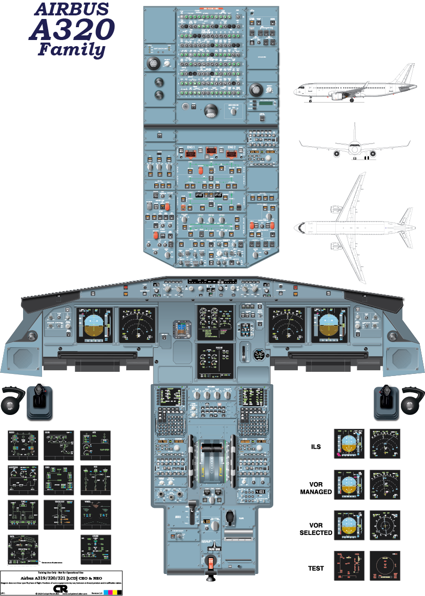

# fbw-system

### History
Airbus first introduced its Fly-By-Wire system with the A320 in 1988 which was a hallmark success by changing manual flight controls of an aircraft with an electronic Interface.

### Motivation
This repository is an attempt ( with no domain knowledge ) about how the abstraction between software and hardware could work within a Fly-by-wire enabled aircraft and making sure that the controller works logically.

### Outlook of test cockpit and PFD (Primary Flight Display )

